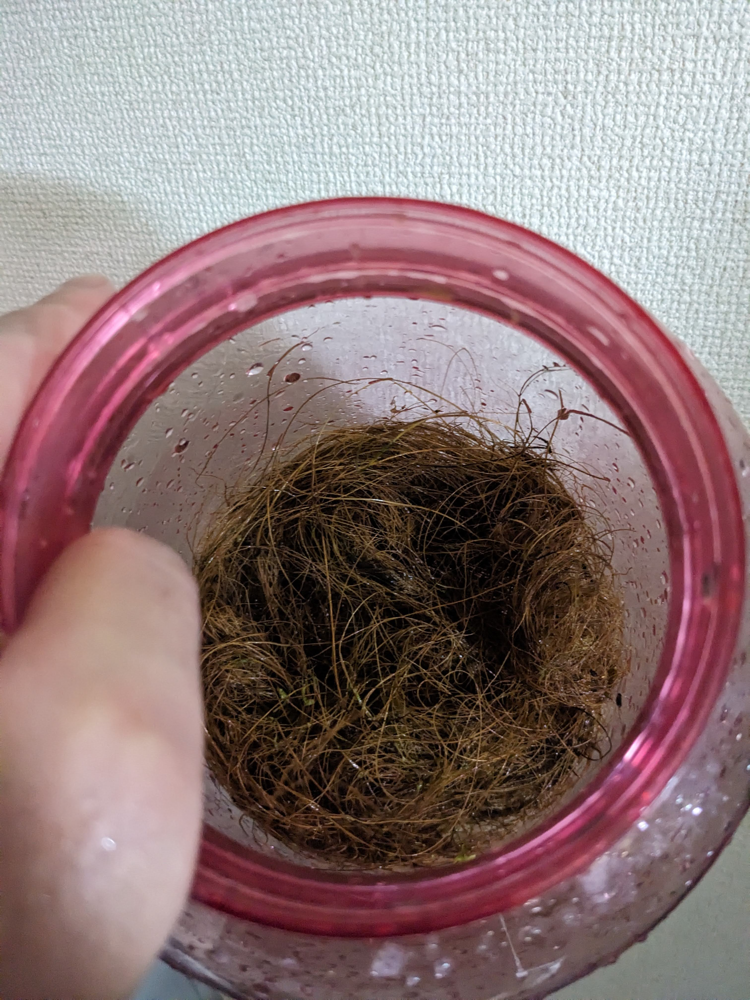

# アブストラクション
この記事は、宇宙空間での植物栽培実現のための実験の一環として豆苗の再生栽培を行った記録である。
今後、栽培ロボットを使用した省人化や自動化、安定化や効率化を目指すものとする。
表題をつけるとしたら、「豆苗の単純水栽培実験と判明した問題点」だろうか

# はじめに
先日、秘密結社オープンフォース総統(@nanbuwks)の命により起稿した栽培ロボットに関する記録(https://github.com/busyoucow/SpacePlantGermination)や瓶内発芽試験記録(https://github.com/busyoucow/SpaceRobotFarmTest01)をひとまずイベント合わせで脱稿し一息ついていた。

そんなGW前の平和のなか、総統から次の指令が下された。
「発芽試験に使った瓶を熱湯かアルコール消毒して、豆苗でも育ててください。」

私はその時、いつぞや購入した蒸留酒をどう飲もうか考えた…

ちなみにこの原稿は、焼酎乙類のお湯割りにあうつまみのレシピ原稿ではない。断じて。
そもそも宇宙空間で無重力下のもとアルコールを飲むのは自殺行為に等しい。
ボルドーの左岸を宇宙軍艦の重力区画で嗜むのは相当な贅沢であろう。

ちなみにその晩食べたメンチカツとレモンチューハイの相性は最高であった。

# 用意したもの
- 栽培用プラスチック瓶
- 防虫用ネット
- 先端ストーンつき釣り用エアーポンプ
- ハイポネックス同等品6-10-5液肥
- 根つき豆苗
- AC電源LEDライト

# 栽培開始
豆苗はそら豆などを使った豆の苗を食するものであり、可食部を切っても根を水に浸しておくと何度か再生する物価高の時代に有難い野菜である。

  

今回は半閉鎖空間で水耕栽培したらどうなるか試行するものである。
まずは豆苗の可食部を切っておいしく頂くとする。

  

必要なのはここから。根の部分を洗浄した瓶に入れるため二つに割り水と一緒に入れる。

  

## おっと、やりなおし
総統の追加仕様指示により洗浄した瓶の除菌が必要になった。
瓶内発芽試験に使った瓶とエアーポンプの先端ストーンを洗って熱湯消毒する。

# 4週間ほどの経過一覧
- 4/21 豆苗再生栽培開始
- 4/22 使用器具消毒して仕切り直し
- 4/29 1回目の収穫
- 5/3 水替えと経過観察
- 5/8 2回目の収穫
- 5/14 3回目の収穫
- 5/21 4回目の収穫と腐敗開始
- 5/24 腐敗により栽培終了

# 以後経過観察を時系列にて書き出す

## 4月21日 豆苗をスーパーで入手し切って調理する 
必要なのは残った根の部分
以前の閉鎖空間発芽試験(https://github.com/busyoucow/SpacePlantGermination)で使用したプラスチック瓶を再使用する

  
  

内部を撤去し洗浄 瓶も洗浄しヤシがらは再利用してベースとする
エアーポンプもストーン含め洗浄し再度使用する

  
  

根は取り回しやすいよう半分に割って瓶に何とか入れる
水に液肥ハイポネックス同等品6-10-5を3滴に水で薄めたものを入れる

  
  

## 4月22日 総統より追加要求仕様があり一旦根の部分を含め撤去
ヤシがらなど以前のものを再使用した部分は全て廃棄
瓶とエアーポンプを熱湯で消毒する

  

根は水道水で洗浄し排水口ネットでバラバラにならないようまとめる

  

根の切断面は若干緑が出てきたようだ
水も交換し液肥も入れなおす

  
  

## 4月29日 豆苗苗設置後の初収穫

  

茎は元の豆苗とは違い白くなく緑色を含む

  

5本収穫できた

  

葉は四つ葉というより本葉に近い感覚

  

もやしと一緒に煮てラーメンとして食す
本来であれば豆苗の水替えは一日1～2回必要なため雑菌が入り込んでいる疑いがあり充分加熱することにした
食感は筋が出てきたが嚙み切れないほどではない

  
  

## 5月3日 豆苗の水替えのみで収穫はなし
何本かは成長しているがやはり根の個々により成長差があるようだ

  

とはいえ葉も茂りこれからを期待させる

  

## 5月8日 豆苗2回目の収穫
茎は長く伸び瓶の口を超えていた 先端は葉ではなく蔓のようになっていた

  

茎が瓶の口につけていた防虫ネットを押し出すようになっていたため外向きに付け替えたが今後は対策が必要に思う

  
  

伸びていた茎だけ収穫したが長短含めて24本収穫できた

  

本葉もしっかりついていたため炒め物も検討したが今回も即席袋めんの麵と一緒のタイミングで入れ
3～4分程度煮込んだ 適度にシャキシャキしていて 悪くない

  
  

そろそろ根も成長し最初二つに切断したにもかかわらず茎の成長もあいまって根株を取り出すのが大変になってくる まさに草生える
豆苗の生命力しか勝たん

## 5月14日 豆苗3回目の収穫

  

根がだいぶ伸びて取り回しが大変になってくる
今回の水替えで液肥を3～4滴→5～6滴に増量した

  

今回の収穫は12本

  

今回はラーメンの銘柄を変えてみた

  
  

## 5月21日 豆苗4回目の収穫
生えているうち一本はとうとう防虫ネットを押し出してくる
  

しかしそれ以外は短く細い
一部の豆に白カビが生え、切った茎の何本かは再生せず茶色く腐ってきた

  

今回の収穫は5本

  

臭気は特に感じなかったが、再生しない茎があるため
次回で一旦栽培試験は終了かもしれない

今回はもやしニラミックスと共に雑炊に入れてみた

  
  

## 5月24日 終了
深夜に出先から戻ったら植物の腐った匂いがする
瓶からは水の腐敗臭と植物の腐敗臭が発生し根は全体が茶色く変色している

瓶の中にはエアーポンプで送られた空気による泡が大きく膨らんでいた

  

豆苗の根の部分は完全に成長を止め腐っていた

  

根を廃棄する 瓶とエアーポンプストーンは洗浄と熱湯消毒して終了とする

  

# おわりに

4月下旬は気温22度程度であったのに対し5月は気温25度を越える日も続いた
土に植える露地栽培では豆苗はその程度で腐敗したりはしないのだろうが
水を定期的に替えるとはいえ滞留させて使用する水耕栽培では腐敗もやむなしかもしれない
そこで栽培ロボットの有用性が考えられるのだが、何よりも水はけをきちんとした土の偉大さを感じる
我々はやはり土から離れては生きられないのか…？

噴霧栽培ではこのようなことが起こらないことを願って筆を置くこととする
